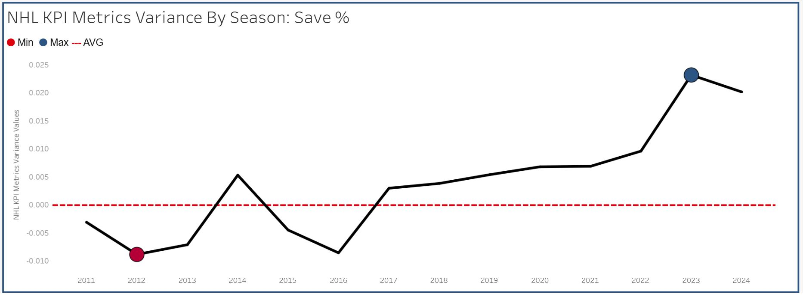

# Predicting NHL Regular Season Wins

This project uses multiple linear regression to predict NHL regular season wins based on team metrics collected from 2007 to 2023. The analysis seeks to discover metrics that are more likely to secure more wins through out the regular seaosn. Drawing from data sourced via the [NHL API](https://github.com/Zmalski/NHL-API-Reference) and webscraping [naturalstattrick.com](https://www.naturalstattrick.com/glossary.php?teams#), the project not only identifies key predictors of success but also offers actionable insights, especially for junior hockey coaches seeking data-driven strategies to enhance team performance.

# Table of Contents
- [Project Background](#project-background)
- [Data Structure & Initial Checks](#data-structure--initial-checks)
- [Project Workflow](#project-workflow)
- [Executive Summary](#executive-summary)
- [Insights Deep Dive](#insights-deep-dive)
- [Recommendations](#recommendations)
- [Assumptions and Caveats](#assumptions-and-caveats)

# Project Background
This analysis is designed for coaches in the GTA junior hockey community, particularly those working with players aged 10 to 16. It provides actionable insights into improving regular season performance by identifying the key metrics that drive win productivity. By leveraging these insights, coaches and instructors can refine their training and game strategies to optimize team success. This project was developed for [Maskin Hockey](https://maskinhockey.ca/), hockey program dedicated to junior coaching and player development at a high level.

# Data Structure & Initial Checks

- The nhldb database documentation, database lineage graph, data quality checks, and SQL queries can viewed here [Link](https://nhl-db-team-season-stats.netlify.app/#!/overview)
- ETL Pipline can be viewed here [Link](./ETL/)
- ELT Pipline can be viewed here [Link](/ELT/DBT/NHL_Data/)

# Project Work Flow

# Executive Summary

### Overview of Findings

This analysis identifies puck possession, shot quality, and special teams performance as the strongest predictors of regular season success. Teams that consistently generate scoring chances across all danger levels—even low-danger opportunities—tend to perform better, emphasizing the importance of sustained offensive pressure. Additionally, special teams efficiency (penalty kill and power play success) plays a crucial role in influencing win totals. On the defensive side, limiting high-danger goals against is critical, reinforcing the impact of strong goaltending and defensive structure. These insights provide a data-driven framework for coaches to refine their strategies and optimize team performance.

Winipeg Jets currently have the most wins so far this 2024/25 season. The following visualizations show why. The dashboard can be found here [Link](https://nhl-kpi-dashboard.netlify.app/)

# Insights Deep Dive

### Key Positive Predictors

#### 1. Low Danger Chances For (3.55)
- This is the largest *positive* coefficient.  
- Suggests that **generating a higher volume of low-danger scoring opportunities** still correlates with improved performance or outcomes.  
- Implies that sustained offensive pressure, even if not always in prime scoring areas, can have a beneficial cumulative effect.

#### 2. Medium Danger Goals For Percentage (2.56)
- Highlights the **importance of converting medium-danger chances**.  
- Teams that capitalize on these mid-quality opportunities see a significant boost in the target variable.

#### 3. High Danger Goals For per 60 Minutes (2.34)
- Emphasizes that successfully **finishing high-danger chances** is crucial.  
- Reinforces the idea that high-quality scoring opportunities—and the ability to convert them—drive positive results.

#### 4. Penalty Kill Net Percentage (1.90)
- Strong penalty-killing performance **reduces opponents’ scoring and boosts overall team success**.  
- Indicates the critical role of defensive special teams in achieving favorable outcomes.

#### 5. Power Play Net Percentage (1.47)
- Suggests that **efficient power-play execution** has a clear positive impact.  
- Converting on power-play opportunities shifts momentum and contributes significantly to overall performance.

#### 6. Low Danger Goals For per 60 Minutes (0.38)
- A smaller but still positive influence.  
- Reaffirms the notion that **even low-danger attempts that turn into goals** can tip outcomes in a team’s favor over time.

---

## Key Negative Predictor

### High Danger Goals Against per 60 Minutes (-1.95)
- The only negative coefficient in the model.  
- Indicates that **conceding more high-danger goals** has a detrimental effect on the target outcome.  
- Highlights the importance of **strong defensive play and goaltending**, especially in high-threat situations.

---

## Combined Insights
- **Offense Matters:** Large positive coefficients for **low- and medium-danger creation** and **converting high-danger chances** underscore the value of both shot volume and quality finishing.  
- **Special Teams Are Key:** The positive impacts of **penalty kill and power play net percentages** show how pivotal special teams execution can be.  
- **Defense/Goaltending Impact:** A negative coefficient for **high-danger goals against** reminds us that preventing quality chances against is just as important as generating them.  
- **Intercept as a Baseline:** The high intercept suggests a strong baseline level in the model, with the other features serving as refinements or adjustments around that baseline.

Exploratory data anlysis can be found [link](/Analysis/Regression_Analysis/Regular_Season_Wins_Regression_Analysis/NHL_2007_2023_Regular_Season_Wins_Regression_EDA.ipynb).

Multiple linear regression and k-mean cluster analysis can be found here [link](/Analysis/Regression_Analysis/Regular_Season_Wins_Regression_Analysis/NHL_2007_2023_Regular_Season_Wins_Multiple_Linear_Regression.ipynb).

# Recommendations  

### 1. **Prioritize Sustained Offensive Pressure**  
   - Encourage teams to **generate a high volume of low-danger chances**, as sustained offensive zone time correlates with increased success.  
   - Develop systems that maintain puck possession and allow for continuous offensive cycling, even in non-prime scoring areas.  

### 2. **Capitalize on Medium and High-Danger Scoring Opportunities**  
   - Focus on **efficient shot selection and finishing ability** in medium- and high-danger areas.  
   - Implement training that emphasizes **quick puck movement in the slot and crease** to improve scoring conversion rates.  
   - Encourage players to **drive the net and create traffic** to increase rebound opportunities.  

### 3. **Strengthen Special Teams Execution**  
   - **Power Play:**  
     - Develop structured **entry plays and high-percentage shooting formations** to maximize conversion.  
     - Encourage **quick puck rotation and net-front presence** to create optimal scoring conditions.  
   - **Penalty Kill:**  
     - Improve defensive positioning and **stick placement to limit passing lanes**.  
     - Emphasize **aggressive forechecking and clearing strategies** to disrupt opponent setups.  

### 4. **Improve Defensive Zone Coverage & Goaltending in High-Danger Areas**  
   - Focus on defensive systems that **limit high-danger chances against**, as they have the strongest negative impact on win probability.  
   - Implement drills that improve **defensive awareness, gap control, and net-front clearing strategies**.  
   - Ensure goaltenders receive targeted training on **high-danger save situations**, such as cross-crease movement and lateral tracking.  

### 5. **Use Data-Driven Player Development**  
   - Integrate **video analysis and analytics** into coaching strategies to assess individual and team performance in key metrics.  
   - Identify **players who excel in generating scoring chances** and tailor their development plans accordingly.  

### 6. **Adopt an Adaptive Coaching Approach**  
   - Monitor **in-game performance metrics** and adjust strategies dynamically to exploit opponent weaknesses.  
   - Develop a **mid-season review framework** using key predictors from this analysis to refine tactics and optimize line combinations.  
  

# Assumptions and Caveats  
  
- **Junior hockey differs significantly from the NHL** in multiple ways:  
  - **Game Length:** Junior hockey games are often shorter, meaning less total ice time for players and fewer opportunities to generate the same volume of scoring chances as in the NHL.  
  - **Player Development:** Young players are still developing physically and may not execute at the same level as fully matured professional athletes. Skill gaps and inconsistency in execution can influence outcomes differently than in the NHL.  
  - **Rule Differences:** Rule changes at the junior level, such as **the delayed introduction of body checking**, can affect defensive strategies and game flow compared to professional play.  
  - **Special Teams Efficiency:** Power play and penalty kill strategies may not be as refined at the junior level due to **less experience and varying coaching philosophies**, potentially affecting their impact on game results.  
  - **Goaltending Consistency:** Junior goalies tend to be less experienced and more prone to fluctuations in performance compared to professional counterparts, which may make certain defensive metrics less reliable in predicting outcomes.  
  - **Roster Turnover:** Junior teams experience higher turnover rates due to age restrictions and player development pathways, which may introduce additional variability not captured in this analysis.  

These factors should be considered when applying NHL-based insights to junior hockey, as the differences in gameplay and player development may require adjustments to coaching strategies.
