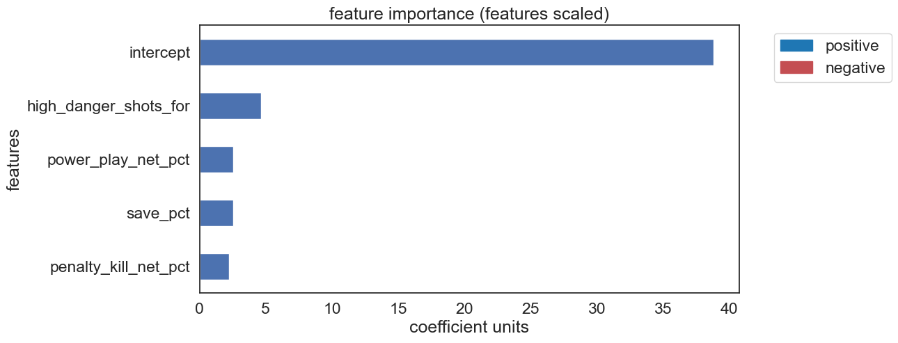

# **Predicting NHL Regular Season Wins**

## **Overview**
This project leverages multiple linear regression to predict NHL regular season wins based on team metrics collected from 2007 to 2023. The goal is to identify the key performance indicators that contribute most significantly to winning games throughout the regular season. 

By analyzing data sourced via the [NHL API](https://github.com/Zmalski/NHL-API-Reference) and web scraping from [naturalstattrick.com](https://www.naturalstattrick.com/glossary.php?teams#), this project not only highlights the strongest predictors of success but also provides actionable insights—particularly for junior hockey coaches looking to implement data-driven strategies to enhance team performance.

---

## **Table of Contents**
- [Project Background](#project-background)
- [Data Structure & Initial Checks](#data-structure--initial-checks)
- [Project Workflow](#project-workflow)
- [Executive Summary](#executive-summary)
- [Insights Deep Dive](#insights-deep-dive)
- [Recommendations](#recommendations)
- [Assumptions and Caveats](#assumptions-and-caveats)

---

## **Project Background**
This analysis is tailored for coaches in the GTA junior hockey community, particularly those working with players aged 10 to 16. It provides insights into improving regular season performance by identifying key metrics that drive winning outcomes. By leveraging these findings, coaches and instructors can refine their training methodologies and in-game strategies to optimize team success.

This project was developed for [Maskin Hockey](https://maskinhockey.ca/), a hockey program dedicated to high-level junior coaching and player development.

---

## **Data Structure & Initial Checks**

- **Database Documentation, Lineage Graph, Data Quality Checks, and SQL Queries:** [View Here](https://nhl-db-team-season-stats.netlify.app/#!/overview)  
- **ETL Pipeline:** [View Here](./ETL/)  
- **ELT Pipeline:** [View Here](/ELT/DBT/NHL_Data/)  

---

## **Project Workflow**

---

## **Executive Summary**

### **Key Findings**
The analysis reveals that **puck possession, shot quality, and special teams performance** are the strongest predictors of regular season success. 

- Teams that consistently generate **scoring chances at all danger levels**—including low-danger opportunities—tend to perform better, highlighting the value of sustained offensive pressure.  
- **Special teams efficiency (penalty kill and power play success)** plays a crucial role in determining overall win totals.  
- On the defensive end, **limiting high-danger goals against** is critical, emphasizing the importance of strong goaltending and structured defensive play.  

### **Current Season Insights**
As of the 2024-25 season, the **Winnipeg Jets** currently have the most wins. The visualizations below illustrate why:  

- [View Dashboard](https://nhl-kpi-dashboard.netlify.app/)  

  
  
  
  
  
  
  

---

## **Insights Deep Dive**

  
  

### **Key Positive Predictors**
These metrics have the strongest positive correlation with winning:

#### **1. Low-Danger Chances For (+3.55)**
- The largest *positive* coefficient in the model.  
- Suggests that **generating a high volume of low-danger scoring opportunities** correlates with increased success.  
- Highlights the importance of sustained offensive pressure, even outside prime scoring areas.

#### **2. Medium-Danger Goals For Percentage (+2.56)**
- Reinforces the value of **converting medium-danger chances** into goals.  
- Teams that capitalize on these opportunities see a significant boost in wins.

#### **3. High-Danger Goals For per 60 Minutes (+2.34)**
- Successfully **finishing high-danger chances** is crucial.  
- This metric underscores the importance of high-quality shot creation and finishing ability.

#### **4. Penalty Kill Net Percentage (+1.90)**
- A strong penalty kill **reduces opponent scoring and improves overall team success**.  
- This highlights the impact of defensive special teams.

#### **5. Power Play Net Percentage (+1.47)**
- **Efficient power-play execution** directly contributes to more wins.  
- Teams that capitalize on man-advantage situations gain a strategic edge.

#### **6. Low-Danger Goals For per 60 Minutes (+0.38)**
- While a smaller coefficient, it reinforces that **even low-danger goals contribute positively over time**.

---

### **Key Negative Predictor**
#### **High-Danger Goals Against per 60 Minutes (-1.95)**
- The only *negative* coefficient in the model.  
- Suggests that **allowing more high-danger goals significantly reduces win probability**.  
- Highlights the importance of **strong defensive play and goaltending**.

---

## **Exploratory Data Analysis**
- [Regular Season Wins EDA](./Analysis/Regression_Analysis/NHL_2007_2023_Regular_Season_Wins_Regression_EDA.ipynb)  
- [Multiple Linear Regression & K-Means Clustering](./Analysis/Regression_Analysis/NHL_2007_2023_Regular_Season_Wins_Multiple_Linear_Regression.ipynb)  

---

## **Recommendations**

### **1. Prioritize Sustained Offensive Pressure**  
- Encourage teams to **generate a high volume of low-danger chances**.  
- Implement strategies to **maintain puck possession and offensive zone time**.  

### **2. Maximize Conversion of Medium & High-Danger Chances**  
- Train players to **capitalize on medium- and high-danger scoring areas**.  
- Implement systems that emphasize **quick puck movement in high-traffic zones**.  

### **3. Improve Special Teams Execution**  
#### **Power Play**  
- Focus on **structured plays and high-percentage shooting formations**.  
- Increase **net-front presence and quick puck rotation**.  
#### **Penalty Kill**  
- Improve **defensive positioning and aggressive forechecking**.  
- Disrupt opponent setups with **efficient clearing strategies**.  

### **4. Strengthen Defensive Zone Play & Goaltending**  
- Emphasize **limiting high-danger shots against** through defensive structure.  
- Train goaltenders to excel in **high-threat situations**.  

### **5. Implement Data-Driven Player Development**  
- Use **video analysis and analytics** to track individual performance.  
- Adjust training programs based on **player strengths and weaknesses**.  

### **6. Adaptive Coaching Strategies**  
- Monitor **in-game analytics** and adjust strategies dynamically.  
- Conduct **mid-season performance reviews** to refine tactics and optimize player usage.  

---

## **Assumptions & Caveats**  
- **Junior hockey differs from the NHL** in game structure, skill level, and special teams execution.  
- **Rule variations** (e.g., body checking rules) may impact the effectiveness of some strategies.  
- **Higher roster turnover** in junior hockey introduces additional variability.  

These factors should be considered when applying NHL-based insights to junior-level coaching.  

---

### **Final Thoughts**
This analysis provides a **data-driven framework** for improving team performance by identifying the strongest predictors of regular season success. By leveraging these insights, junior hockey coaches can refine their **game strategies, player development programs, and special teams execution** to create a more competitive team environment.  

🚀 *Data-driven hockey coaching starts here.*
