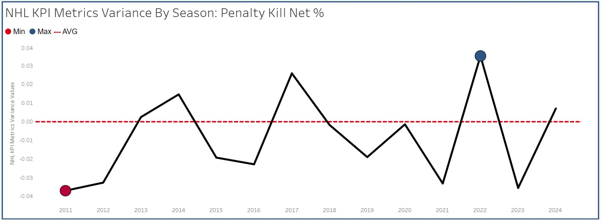
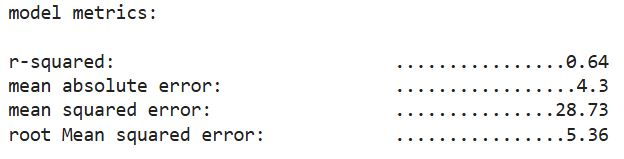

# **Predicting NHL Regular Season Wins**

## **Overview**
This project leverages multiple linear regression to predict NHL regular season wins based on team metrics collected from 2007 to 2023. The goal is to identify the key performance indicators that contribute most significantly to winning games throughout the regular season. 

By analyzing data sourced via the [NHL API](https://github.com/Zmalski/NHL-API-Reference) and web scraping from [naturalstattrick.com](https://www.naturalstattrick.com/glossary.php?teams#), this project highlights the strongest predictors of success in addition to actionable insights to support hockey analysts.

---

## **Table of Contents**
- [Project Background](#project-background)
- [Data Structure and Initial Checks](#data-structure-and-initial-checks)
- [Project Workflow](#project-workflow)
- [Executive Summary](#executive-summary)
- [Insights Deep Dive](#insights-deep-dive)
- [Data Analysis Jupyter Notebooks](#Data-Analysis-Jupyter-Notebooks)
- [Recommendations and nest Steps](#recommendations-and-next-steps)
- [Assumptions and Caveats](#assumptions-and-caveats)

---

## **Project Background**
This analysis is tailored for hockey analysts. It provides insights into improving regular season performance by identifying key metrics that drive winning outcomes. By leveraging these findings, analysts will have key metrics to benchmark against when determining how a team is preforming.

---

## **Data Structure and Initial Checks**

- **Database Documentation, Lineage Graph, Data Quality Checks, and SQL Queries:** [View Here](https://nhl-db-documentation.netlify.app/#!/overview)  
- **ETL Pipeline:** [View Here](./ETL/)  
- **ELT Pipeline:** [View Here](/ELT/DBT/NHL_Data/)  

---

## **Project Workflow**

---

## **Executive Summary**

### **Key Findings**
The analysis reveals that **shots in prime scoring areas, save percentage, and special teams performance** are the strongest predictors of regular season success. 

- Teams that generate **scoring chances in high danger levels** tend to perform better, highlighting the value of offensive pressure in prime scoring areas. 
- **Special teams efficiency (penalty kill and power play success)** plays a crucial role in determining overall win totals.  
- On the defensive end, **save percentage** is critical, emphasizing the importance of strong goaltending and structured defensive play.  

### **Current Season Insights**
As of the 2024-25 season, the **Winnipeg Jets** currently have the most wins. The visualizations below illustrate why:  

- [View Dashboard](https://nhl-kpi-dashboard.netlify.app/)  

  
  
  

---

## **Insights Deep Dive**

### Hypothesis

#### Null Hypothesis (H₀)
There is no predictive relationship between the chosen NHL team metrics and the number of team wins during the regular season.

#### Alternative Hypothesis (H₁)
There is a predictive relationship between the chosen NHL team metrics and team wins, meaning that team metrics have an impact on predicting the number of wins a team could achieve during the regular season.

#### Experiment Results
We reject H₀ (null hypothesis) as the rgression model has proven that there is a moderate predictive relationship between the chosen NHL team metrics and the number of team wins during the regular season.

  
  

### **Key Positive Predictors**
The following metrics, which serve as independent variables, account for 64% of the variance in the dependent variable (wins).

#### **1. High-Danger Shots For (+4.65)**
- The largest *positive* coefficient in the model.  
- Suggests that **generating a high volume of high-danger scoring opportunities** correlates with increased success.  
- Highlights the importance of sustained offensive pressure, inside prime scoring areas.

#### **2. Power Play Net Percentage (+2.57)**
- **Efficient power-play execution** directly contributes to more wins.  
- Teams that capitalize on man-advantage situations gain a strategic edge

#### **3. Save Percentage (+2.56)**
- Reinforces the value of **defense** as expressed through **save percentage**.  
- Teams that have higher save percentages, and see a boost in wins. This emphasizes the importance of strong goaltending and structured defensive play.
-

#### **4. Penalty Kill Net Percentage (+2.24)**
- A strong penalty kill **reduces opponent scoring and improves overall team success**.  
- This highlights the impact of defensive special teams.

---

## **Data Analysis Jupyter Notebooks**
- [Regular Season Wins EDA](/Analysis/Regression_Analysis/Regular_Season_Wins_Regression_Analysis/NHL_2007_2023_Regular_Season_Wins_Regression_EDA.ipynb)  
- [Multiple Linear Regression and K-Means Clustering](/Analysis/Regression_Analysis/Regular_Season_Wins_Regression_Analysis/NHL_2007_2023_Regular_Season_Wins_Multiple_Linear_Regression.ipynb)  

---

## **Recommendations and Next Steps**

### **1. Build in game stratagies with the key indicators (KPIs)**
- Using key indicators create a basis for analysts to base their strategy around. 

### **3. Prioritize Offensive Pressure in high-Danger Scoring Areas**  
- Encourage teams to **generate a high volume of high-danger shooting chances**.  
- Implement strategies to **maintain puck possession and offensive zone time**.

### **4. Improve Special Teams Execution**  
#### **Power Play**  
- Focus on **structured plays and high-percentage shooting formations**.  
- Increase **net-front presence and quick puck rotation**.  
#### **Penalty Kill**  
- Improve **defensive positioning and aggressive forechecking**.  
- Disrupt opponent setups with **efficient clearing strategies**.  

### **5. Strengthen Defensive Zone Play and Goaltending**  
- Emphasize **limiting high-danger shots against** and increasing **save %** through defensive structure.  
- Encourage shot blocking in the defensive zone.
- Train goaltenders to excel in **high-threat situations**.  

### **6. Adaptive Coaching Strategies**  
- Monitor **in-game analytics** and adjust strategies dynamically.  
- Conduct **mid-season performance reviews** to refine tactics and optimize player usage.

---

## **Assumptions and Caveats**  
The above reccomendations have not been tested are assumed stratagies that may support the the key indicators and/or KPIs in predicting wins.This assumption  should be considered when applying the reccomendations.  

---

### **Final Thoughts**
This analysis provides a **data-driven framework** for improving team performance by identifying the strongest predictors of regular season success. By leveraging these insights, hockey analysts can refine their **game strategies, player development programs, and special teams execution** to create a more competitive team environment.
